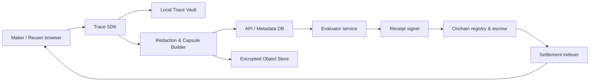

# Rexo — Technical Requirements

## 1. Design principles

1. **Private by default:** 生の会話・入力・成果物は公開しない。
2. **Verifiable, not surveillant:** 実行の価値を検証しても、利用者の監視装置にしない。
3. **Chain as settlement, not database:** 公開チェーンには最小限のコミットメント、状態、分配だけを置く。
4. **Human-readable trust:** すべての自動評価・分配は、人間が読める根拠を持つ。
5. **Progressive decentralization:** MVP の審査・異議処理は中央運営でもよい。預かり資金と分配の透明性を先に高める。

## 2. Reference architecture



### Components

| Component | Responsibility | Data classification |
|---|---|---|
| Trace SDK | LLM / tool event capture, local buffering, consent | Secret-capable |
| Local Trace Vault | Encrypted original Trace and optional inputs | Highly confidential |
| Redaction engine | PII / secrets / policy screening; user review | Highly confidential |
| Capsule builder | Trace から再利用可能な手順と評価を生成 | Confidential until published |
| API + Postgres | Account, Capsule metadata, licenses, disputes | Confidential |
| Object store | 暗号化した非公開アーティファクト | Highly confidential |
| Evaluator | 自動テスト、匿名レビューの調整 | Internal |
| Chain contracts | Commitments, escrow, settlement receipts | Public / minimal |

## 3. Data model

```text
User(id, passkey_credential_id, wallet_address, consent_versions)
Trace(id, owner_id, local_commitment, encrypted_location, retention_policy)
Receipt(id, trace_id, public_summary, salt_commitment, evaluator_signature)
Capsule(id, author_id, version, manifest, receipt_root, status)
License(id, capsule_version, reuser_id, price, escrow_status, evaluation_id)
Evaluation(id, license_id, test_results, reviewer_signatures, decision)
Settlement(id, license_id, amount, split_version, chain_tx)
Dispute(id, license_id, reason, evidence_location, status)
```

`manifest` に保存してよいものは、目的・入力型・出力型・許可ツール・概略手順・評価仕様・価格・ライセンスである。原文プロンプト、原文出力、顧客識別子、秘密鍵、API キーを含めてはならない。

## 4. Onchain requirements

MVP は特定チェーンへの依存を避ける。ただし、EVM 互換 L2 または Solana の低コスト環境を一つ選び、テストネットから開始する。実装時は、次のインターフェースを満たすこと。

### Contracts

- `CapsuleRegistry`: Capsule 版、manifest hash、Receipt root、失効状態を記録する。本文は保存しない。
- `LicenseEscrow`: 一件の利用料を受け、評価結果または異議処理の決定に従い支払う。
- `SplitRegistry`: 固定した分配先と比率を版ごとに記録する。
- `SettlementReceipt`: 決済済みの License ID と金額をイベントで発行する。

### Contract constraints

- アップグレード可能な資金保管契約を MVP では用いない。修正は新規版デプロイで行う。
- オラクルが「成果を真」と決める権限を持たない。評価署名と異議期間を入力にするだけに留める。
- 管理者は凍結、緊急停止、返金提案をできるが、単独で著者取り分を奪えない。
- 金額は利用料のエスクローに限定し、預金・貸付・運用・二次流通を扱わない。

## 5. Security and privacy requirements

- NFR-01: ブラウザ / SDK から外部送信する前に API keys、JWT、秘密鍵、メール、電話番号、住所、カード情報を検知・マスクする。
- NFR-02: 原文を保存する場合は、ユーザー固有の data-encryption key で暗号化し、鍵は KMS / passkey 回復フローで包む。
- NFR-03: Chain に永続化するコミットメントにはランダムな 256-bit salt を必須とする。
- NFR-04: 公開前に Maker が差分画面で確認しなければならない。AI の自動公開を禁止する。
- NFR-05: すべての決済・評価・公開操作に監査ログを持つ。
- NFR-06: 依存パッケージ、コントラクト、Webhook、モデル出力を脅威モデルに含める。

## 6. Evaluation protocol for the Web-production MVP

1. Capsule は、入力スキーマと期待する URL / repository / artifact を定義する。
2. 実行後、Evaluator が Lighthouse、リンク検査、モバイル viewport、アクセシビリティ、指定語句を自動確認する。
3. 自動評価を通過した後、匿名 Reviewer がルーブリックを使って合否・修正要求を提出する。
4. Reuser と Reviewer に 72 時間の異議期間を与える。
5. 解決済み評価に対する署名セットをもとに、Escrow が分配する。

## 7. Observability

- Trace 収集・マスク・失敗の匿名メトリクス
- Capsule 作成から公開までの離脱率
- 評価器ごとの一致率、異議率、処理時間
- エスクロー残高と未解決 Dispute の監視
- セキュリティイベント（PII 検知、公開阻止、権限拒否）

## 8. Non-functional targets

- 通常の Capsule 検索 API: p95 500 ms 未満
- 決済ステータス反映: チェーン確定後 60 秒以内
- ローカル編集時の Trace 書き込み: UI ブロックなし
- PII 検査: 10,000 tokens の Receipt 草案を 5 秒以内
- MVP availability: 月間 99.5%

## 9. Technical acceptance criteria

- 公開 Capsule 100 件を検索・版管理・失効できる。
- 10 種類以上の秘密情報サンプルが公開経路で遮断される。
- 一件の License について、成功・失敗・異議中・返金の状態遷移が二重支払いなく完了する。
- Receipt と evaluation の署名検証を第三者が再現できる。
- UI からウォレットアドレス、ガス、トランザクション hash を通常時に表示しない。
